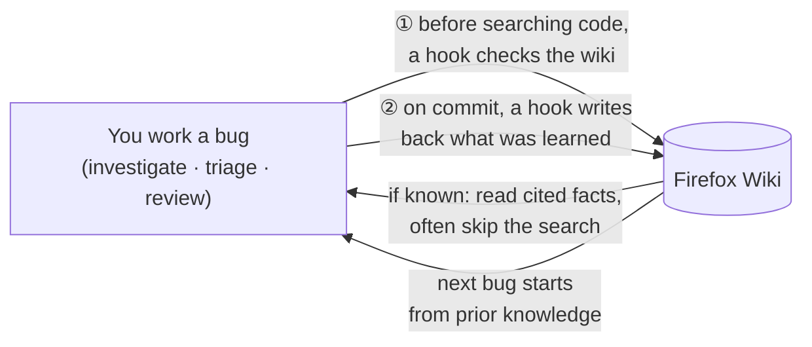
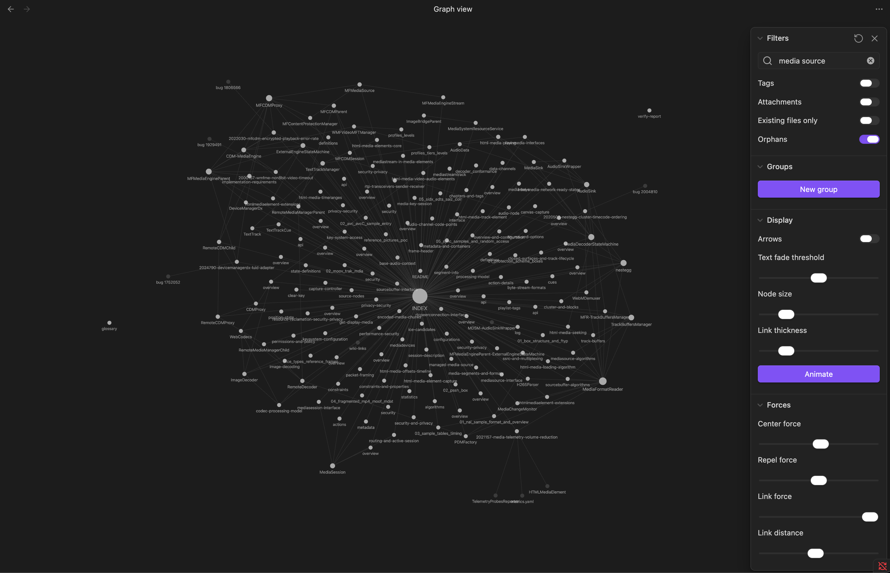

# firefox-wiki-plugin

A Claude Code plugin that gives Claude a persistent memory of Firefox media subsystem knowledge — so it stops redoing the same code archaeology every investigation and builds on what it already knows.

Without this plugin, Claude re-searches the same components, re-reads the same files, and re-derives the same facts every session. With it, knowledge accumulates: every investigation adds to the wiki, and every future investigation starts from what was already learned.

> **The wiki content is maintained in a shared private repo.** You need access to get the accumulated knowledge — without it you start from an empty wiki and lose the team's prior learnings. Request access from :alwu (alwu@mozilla.com) before installing.

## How it works

The whole plugin is one idea: **read the wiki before doing code archaeology, write back what you learn after.** You never run anything — hooks do both halves automatically, so each bug starts from everything earlier bugs taught Claude instead of re-deriving it.



### The four hooks, in plain terms

| When it fires | What it does for you |
|---|---|
| **Before** a code search (`searchfox-cli`, or `grep` under a watched path) | Checks the wiki first. If it has the answer, Claude reads the cited facts and may skip the search. Query terms are alias- and `Class::Method`-expanded, so jargon like `MDSM` still finds `MediaDecoderStateMachine`. |
| **After** a commit in a source repo | Reads the diff/investigation, extracts the durable facts, and saves them for next time. |
| **After** any write to the wiki | A quick lint pass flags broken links and stale references. |
| **During** a tracked skill (`bug-start`, `triage`, `review-patch`, `analyze-profile`, …) | Tags any wiki use with that skill, so `/firefox-wiki:stats` can tell you *which kinds of work* actually consult the wiki. |

That's it — install it and work normally; the loop runs in the background.

Two manual levers when you want them:
- **Add knowledge yourself** — a spec URL, a bug, or a plain fact — with `/firefox-wiki:add`.
- **Tune what triggers the hooks** (search tool, watched paths) and **where the wiki lives** — see [Configuration](#configuration). The tracked-skill list is [`scripts/wiki-relevant-skills.txt`](scripts/wiki-relevant-skills.txt) (one name per line).

## Install

Run these commands in your terminal (not in the Claude Code prompt):

**1. Clone this plugin repo:**
```bash
git clone https://github.com/alastor0325/firefox-wiki-plugin ~/firefox-wiki-plugin
```

**2. Register and install the plugin:**
```bash
claude plugin marketplace add ~/firefox-wiki-plugin
claude plugin install firefox-wiki@firefox-wiki-plugin
```

**3. Clone the wiki content repo:**
```bash
git clone https://github.com/alastor0325/firefox-wiki ~/firefox-wiki
```

**4. Initialize** (in Claude Code):
```
/firefox-wiki:init
```

This verifies dependencies and creates the wiki directory structure. Follow any prompts it shows.

**Requirements:** `jq` · `pandoc` · `bmo-to-md`

macOS:
```bash
brew install jq pandoc && cargo install bmo-to-md
```

Linux:
```bash
sudo apt install jq pandoc && cargo install bmo-to-md   # Debian/Ubuntu
sudo dnf install jq pandoc && cargo install bmo-to-md   # Fedora
```

Windows:
```powershell
winget install jqlang.jq JohnMacFarlane.Pandoc && cargo install bmo-to-md
```

---

## Commands

| Command | Purpose |
|---|---|
| `/firefox-wiki:init` | One-time setup |
| `/firefox-wiki:add <input>` | Add a spec, bug, or fact to the wiki |
| `/firefox-wiki:stats` | View usage metrics and lookup hit rate |

### Adding knowledge

`/firefox-wiki:add` accepts several input types:

| Input | What happens |
|---|---|
| `https://...` | Fetches and distills into `specs/` |
| `/path/to/file.pdf` | Reads PDF and distills into `specs/` |
| `bug 2026875` | Extracts knowledge from the bug |
| Natural language | Writes to `components/`, `relations/`, or `patterns/` |

```
/firefox-wiki:add https://www.w3.org/TR/media-source/
/firefox-wiki:add bug 2026875
/firefox-wiki:add AudioSink runs on the MDSM task queue, not its own thread
```

### Skills that run automatically

These do their work via hooks and other skills — you don't type them by hand (they're not in the slash menu), but it's useful to know they exist:

| Skill | Runs when | What it does |
|---|---|---|
| `lookup` | Start of an investigation/triage, and via the pre-lookup hook | Pulls prior knowledge (reads the compact `index.json` first, falls back to `INDEX.md`) and returns cited context |
| `ingest` | After a commit in a Firefox repo (post-commit hook) | Extracts knowledge from the diff/investigation and writes it back |
| `lint` | Lightweight after every wiki write; `--full` on a schedule | Checks integrity and regenerates the derived caches (`index.json`, `aliases.txt`) |
| `verify` | Nudged by `ingest`/`add` when pages are overdue | Re-reads primary sources to confirm facts are still correct |

---

## Wiki structure (example)

```
~/firefox-wiki/
  components/          # One page per Firefox class or subsystem
  relations/           # Cross-component interaction protocols
  patterns/            # Reusable mechanisms (e.g. WaitForData protocol)
  architecture/        # End-to-end pipeline walkthroughs
  bugs/                # Learning pages for resolved non-security bugs
  triage/              # Triage decision patterns and routing hints
  profiler/            # Profiler markers, observability, case studies
  platform/            # Platform-specific knowledge (WMF/HRESULT, macOS, etc.)
  others/              # Misc reference (e.g. local dev notes)
  specs/               # Distilled spec references (topic_org_identifier naming)
    MSE_W3C/
    EME_W3C/
    HTMLMedia_WHATWG/
    AVC_ITU_H264/
    HEVC_ITU_H265/
    ISOBMFF_ISO_14496_12/
    CENC_ISO_23001_7/
    ...
  wiki-config.json     # Trigger surface: search tool + source paths (configurable)
  glossary.md          # Abbreviation + error-code reference (authoritative)
  INDEX.md             # Master human/Obsidian index (authoritative)
  index.json           # Derived compact index — tiered lookup reads this first
  aliases.txt          # Derived abbreviation map (MDSM↔MediaDecoderStateMachine)
  log.md               # Human-readable change history
  usage-log.jsonl      # Machine-readable event log
  lint-log.json        # Per-page lint and verify timestamps
  verify-report.md     # Latest verification report
```

All pages are plain Markdown with `[[wiki-links]]`. You can open the wiki directory as an [Obsidian](https://obsidian.md) vault to browse and search the accumulated knowledge visually — no configuration needed.

`index.json` and `aliases.txt` are **derived caches**, not authoritative content: `lookup` reads the compact `index.json` first (falling back to the full `INDEX.md` whenever it's missing or its mtime no longer matches), and the pre-lookup hook uses `aliases.txt` to expand abbreviations and `Class::Method` names before searching. Both are regenerated by `/firefox-wiki:lint --full` from `INDEX.md` and `glossary.md`, so deleting them is always safe.



---

## Configuration

The same plugin works as a **shared team wiki** or a **personal wiki** — the only difference is which git repo `WIKI_PATH` points at. Two things are configurable:

**Where the wiki lives — `WIKI_PATH` (environment).** Defaults to `~/firefox-wiki`. To use a different location (a personal wiki, or a second wiki for another subsystem), set `WIKI_PATH`. Because hooks read it from the environment, persist it in the `env` block of `~/.claude/settings.json` — `/firefox-wiki:init` offers to do this for you. It takes effect in the next Claude Code session.

```json
// ~/.claude/settings.json
{ "env": { "WIKI_PATH": "/Users/you/my-graphics-wiki" } }
```

**What triggers the pre-lookup hook — `$WIKI_PATH/wiki-config.json` (travels with the wiki).** `/firefox-wiki:init` creates it; defaults reproduce the original Firefox-media behavior:

```json
{ "schema": 1,
  "search_tool": "searchfox-cli",
  "trigger_paths": ["dom/media"],
  "source_repo_pattern": "(mozilla-central|gecko|mozilla-firefox/firefox)" }
```

- `search_tool` — the command whose invocations fire the pre-lookup check.
- `trigger_paths` — grep paths that fire it (a graphics wiki might use `["gfx", "layout"]`).
- `source_repo_pattern` — which repos' commits trigger auto-ingest.

Per-setting environment overrides (handy for testing): `WIKI_SEARCH_TOOL`, `WIKI_TRIGGER_PATHS` (space-separated), `WIKI_SOURCE_REPO_PATTERN`. Precedence is **env var > `wiki-config.json` > built-in default**, so with neither present everything behaves exactly as before.

---

## Accuracy

The wiki is only useful if its facts are correct. Three layers work together to ensure this:

**Write-time — prevent bad data from entering.**
Every fact must cite a verifiable source: a Searchfox permanent URL, a spec section (e.g. "ITU-T H.265 §7.4.8"), or a Bugzilla bug number. Claude will not write a fact it cannot point to. Facts from memory or inference are rejected.

**Lint — catch drift automatically.**
After every wiki write, a hook checks the modified pages for broken links, dead Searchfox URLs, and structural issues. A full scan runs on a schedule (components every 14 days, specs every 180 days) to catch pages that have gone stale since they were written.

**Verify — confirm against ground truth.**
For pages that are overdue, `ingest` and `add` will nudge you to run `/firefox-wiki:verify`. This re-reads the original primary sources — Firefox source code, spec URLs, vendor docs — and flags any facts that no longer match. Critically, verify is forbidden from reading the wiki itself, so it cannot mistake a stale wiki page for ground truth.

---

## Measuring usage

Run `/firefox-wiki:stats` after a few investigation sessions. It runs a full analysis script ([`scripts/wiki-stats.py`](scripts/wiki-stats.py)) over the usage log and prints a report with these metrics:

- **Overall hit rate** — of all code searches that triggered a wiki check, how many found relevant content. A rising rate means Claude is finding prior knowledge before reading code.
- **Per-skill coverage** — of N runs of a skill, how many consulted the wiki at all. This is the unbiased answer to "is the wiki being used where it should be?" — a low number is not a low hit rate, it means the wiki isn't being reached for during that kind of work.
- **Per-skill hit rate** — when a skill does consult the wiki, how often it finds something. Low coverage + high hit rate means the content exists but isn't being reached; high coverage + low hit rate means the content is missing for that skill's topics.
- **Most / never consulted pages** — which pages are load-bearing, and which have never been read (candidates to improve or remove).
- **False-confidence rate** — how often a wiki-sourced hypothesis turned out wrong (from `ingest` events). A high rate means some pages are misleading investigations — run `/firefox-wiki:verify`.
- **Wiki-hit outcome** — of the bugs whose code search hit the wiki, how many were later corrected by a human (joins the new per-event `bug_id` to the triage decisions log). Unlike the false-confidence rate, this needs no `ingest` event, so it works even when nothing was ingested for the bug.
- **Per-pattern correction rate** (triage) — joins triage wiki reads to `~/firefox-triage/decisions-log.jsonl`: which patterns correlate with a human revising the draft. High-correction patterns are candidates to re-verify or rewrite.

The report ends with concrete recommendations derived from the above. If per-skill coverage is low for the areas you work in, the wiki likely lacks content there — use `/firefox-wiki:add` to seed it.

Useful flags: `--since YYYY-MM-DD` (window to a date range), `--json` (machine-readable output).

> Attribution is best-effort: a skill stays "current" until the next skill starts, so wiki reads done after a skill's work but before the next one keep the prior tag (a mild over-count). Parallel sub-agents of the same skill (e.g. `/triage` fan-out) share one slot — the *skill* stays correct, only the per-instance link is approximate. See [`docs/skill-attribution.md`](docs/skill-attribution.md).

---

## Content policy

**Never write to the wiki:**
- PoC code, crash triggers, exploit chains, or attack vectors
- Crash addresses, allocation sizes, or memory offsets
- Bug numbers of security-restricted Bugzilla bugs
- Pre-fix conditions stated as current facts

**Security bugs:** extract only neutral structural facts (component role, threading, ownership). If none exist, write nothing.

**Specs:** always distill — never copy verbatim. Add the required notice at the top of each page for private/paid specs (ISO, IEC, ITU-T).

---

## Development

What takes effect when you edit the plugin:

| You edit | Takes effect |
|---|---|
| A hook **script** in `scripts/` (`*.sh`, `wiki-stats.py`) | **Immediately** — hooks re-read the script on each fire |
| A **`skills/*/SKILL.md`** | **After a Claude Code restart** — skills are cached at session start (`/reload-plugins` does not re-read them) |
| **`hooks/hooks.json`** (adding/removing a registration) | **After a Claude Code restart** |

```bash
claude plugin validate .               # validate plugin structure
claude -p '/firefox-wiki:lint --full'  # exercise a skill from the CLI
```

**Tests** (no dependencies; run directly):

```bash
bash    tests/run-all.sh                   # run every suite below and aggregate pass/fail
```

Or individually:

```bash
bash    tests/test-pre-lookup.sh           # pre-lookup hit/miss, alias expansion, configurable triggers
bash    tests/test-wiki-config.sh          # _wiki-config.sh: precedence + path-boundary matching
bash    tests/test-triggers.sh             # log/lint/ingest hooks: bug_id, gating, ingest self-exclusion
bash    tests/test-skill-attribution.sh    # current-skill slot model
bash    tests/test-allowlist-sweep.sh      # every allowlisted skill: attribution + exists
python3 tests/test-wiki-stats.py           # wiki-stats.py metric computation
```

Bump `version` in `.claude-plugin/plugin.json` (and the `version` in any edited `SKILL.md`) before any commit that changes skills or hooks. After installing an update, **restart Claude Code** so the skill changes load — the script-only changes are already live.
